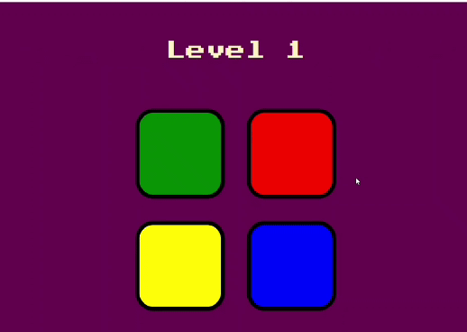

# Game Pattern With Sound using JavaScript and JQuery

### Tap Here to Try this game live :  [Github Pages](https://yahya-khodr.github.io/game_pattern_JQuery/)





## ✅ Lessons Learned

- JavaScript HTML DOM events
- JQuery with the Effect Methods
- this keyword and attr
- How to play audio in JavaScript
- Arrays in JavaScript

## 🚀 Getting Started 
TO run this project there are two scripts:
 - JavaScript (```js_solutions.js```) 
 - JQuery Script (```jquery_solution.js```)

Add one of those two Scripts
```JavaScript 
 <script src="<-Add script Here->"></script>
 ```

## 🕹 How Game Works

- The computer will randomly generate and click on one of the pattern buttons
- The player goal is to replicate the pattern buttons that generated by the computer

